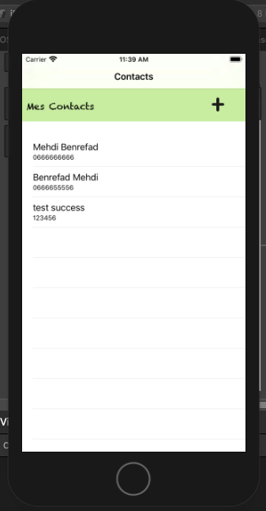
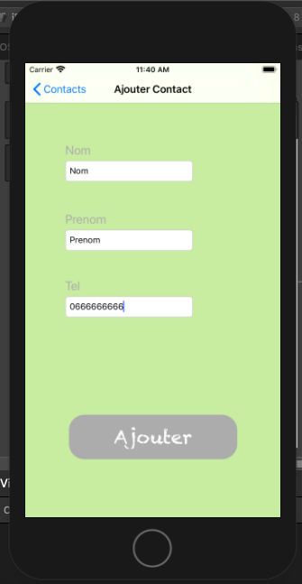
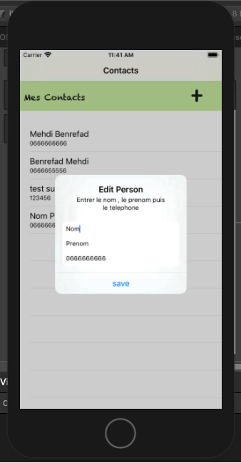
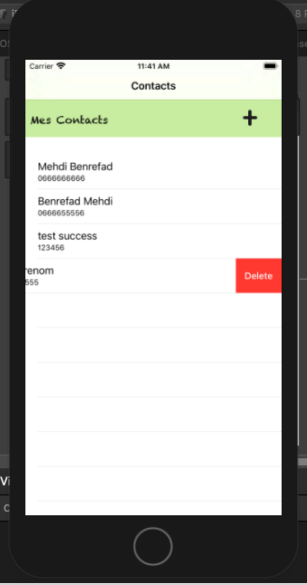

# Contacts-App-IOS
IOS App Written in Swift

<h4> Contacts-App est une application qui permet aux utilisateurs de gerer leurs contacts (Ajouter, Modifier , Supprimer) en stocquant leurs informations 
dans une base de donnees SQLite en se basant sur core data </h4>
  
<h3>Liste des Contacts :</h3>

<h3>Ajouter un Contact :</h3>

<h3>Modifier un Contact :</h3>

<h3>Supprimer un Contact :</h3>

